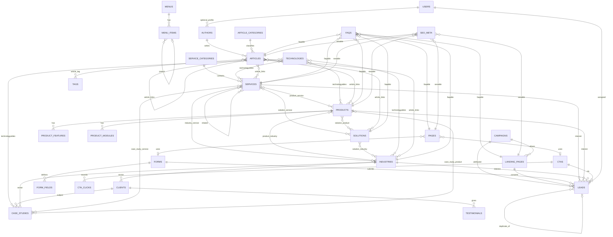

# MARKEDGE TECHNOLOGIES — PHASE 1 ARCHITECTURE

Version: 1.0 (2026-09-16)
Status: Proposed. Awaiting approval before Phase 2.
Inputs: Master Build Prompt, `MARKEDGE_PROJECT_AUDIT.md` (approved), repository inspection.

This document is the technical blueprint that Phase 2 onward implements directly. It contains no application code. Where a decision needs the owner's approval it is marked **[APPROVAL]** and collected in section 42.

---

## 1. Executive Architecture Summary

Markedge's website is a **single Laravel 13 modular monolith** that serves five jobs from one codebase and one database: brand site, capability/product showcase, SEO content platform, campaign landing-page engine and lead-capture/attribution system. Filament 5 is the only admin surface.

The governing principle is **hard-code the engine, admin-manage the content**:

- **Engine (code):** routing, entity models, the typed block system, the SEO/schema renderer, lead capture and attribution, caching, search, permissions, the design system and every Blade/Livewire component.
- **Content (admin):** every page, section, service, product, solution, industry, article, case study, FAQ, CTA, form, landing page, campaign, menu, redirect, SEO field and global setting.

Ten decisions shape everything else:

| # | Decision | Rationale |
|---|---|---|
| 1 | One `PublishStatus` enum (draft, review, scheduled, published, archived) shared by every publishable entity; products use their own `ProductStatus` (draft, active, coming_soon, archived) as the brief requires. | One publishing scope, one preview mechanism, one governance model. |
| 2 | Page composition uses a **typed block system stored as JSON** on `pages.blocks` and `landing_pages.blocks` (Filament Builder). Blocks are defined in code by a `BlockRegistry`; admins choose blocks, order them, fill fixed fields and pick related records. No free styling. | Native Filament UX for add/remove/reorder/toggle, zero extra tables, and design consistency is enforced because every block renders through one Blade component. |
| 3 | Entity detail pages (service, product, solution, industry, case study, article) are **fixed skeleton templates** driven by structured fields, with one optional `blocks` slot for extra sections. | Products and services stay consistent and SEO-structured while still allowing per-record variation. |
| 4 | **Explicit pivot tables** for the commercial relationship graph (service, product, solution, industry, case study) and **two polymorphic pivots** (`technologyables`, `article_links`) for the wide, low-cardinality relations. | Foreign-key integrity where it matters, few tables where it does not. |
| 5 | **One polymorphic `seo_meta` table** with a strict fallback hierarchy, no hard length limits, advisory counters only. | SEO becomes a capability of every entity without per-table columns. |
| 6 | **Schema (JSON-LD) is generated in code from real data** with a per-entity override JSON, never hand-authored per page. | Prevents misleading schema and keeps schema in sync with content. |
| 7 | **Leads are the single conversion record.** Attribution (first and last touch) is stored as flat columns on the lead, captured from a first-party cookie written by middleware. No separate `form_submissions` table. | One table to report on; no duplicated payloads. |
| 8 | **Hybrid forms:** core lead fields are real columns toggled per form; extra fields are admin-defined `form_fields` whose values land in `leads.custom_fields` JSON. | Marketing gets new forms without code; sales gets queryable columns. |
| 9 | **Spatie Permission + Laravel policies** for authorisation; Filament resources call policies, never hide-only. | Permissions scale with the team and are enforced server-side. |
| 10 | **Caching by content version, not by tag.** A single `content:version` counter is bumped on any publish; keys embed it. Works on the current database cache store and on Redis later without code change. | Database cache does not support tags; this avoids stale content indefinitely. |

Stack (unchanged from the brief): Laravel 13.32, PHP 8.5, MySQL 8.4, Filament 5.8, Livewire 4.4, Blade, Tailwind 4, Alpine.js, Vite 8, database queue/cache now with Redis as a config-only upgrade.

---

## 2. Business Architecture

### 2.1 Capability model

```text
MARKEDGE
├── BUILD   (Service Category: Technology)
│     Software Development, Web Development, Mobile App Development,
│     Product Development, Custom Business Applications, API Development
│     & Integration, AI & Automation, UI/UX, Cloud Solutions
├── OPERATE (Service Category: IT Infrastructure)
│     IT AMC, Networking, Server & Infrastructure Management, Cloud
│     Infrastructure, Cybersecurity, Backup & Disaster Recovery, IT Support
├── GROW    (Service Category: Digital Growth)
│     Digital Marketing, SEO, Social Media Marketing, Performance Marketing,
│     Content Marketing, Branding, Lead Generation, Conversion Optimisation
└── PRODUCTS
      Lead Management System, Recruitment Management System, Product N...
```

BUILD / OPERATE / GROW are **the three seeded service categories**. They are data, not code. The homepage sections 4, 5 and 6 are `service_grid` blocks pointing at a category, so a fourth pillar could be added by creating a category.

### 2.2 Objectives mapped to architecture

| Objective | Architectural answer |
|---|---|
| Brand | Homepage as a block-composed Page; design system enforced by components; no fabricated proof (every "proof" block renders only real records or nothing). |
| Authority | Depth through structured entities: services with process/benefits/technologies, products with modules, technologies catalogue, insights with authors. |
| Acquisition | Entity URLs for SEO, `/lp/{slug}` for paid, UTM attribution middleware, campaign entity, social share meta. |
| Conversion | CTA entity with contextual WhatsApp/call/form actions, form engine on every commercial page, lead record with source. |
| Scale | Everything listed in the brief is a row, not a route. New product/service/industry/solution/article/landing page = admin action. |

### 2.3 Truthfulness constraints built into the system

- Stats, logo cloud, testimonial and case-study blocks render **only** real records; when none exist the block renders nothing (and Filament shows a warning that the block is empty on the public site).
- `SoftwareApplication` schema never emits `aggregateRating`, `offers` or `review` unless the fields exist and are filled.
- Seeders create structure (roles, categories, block layouts, product names) and **never** clients, testimonials, metrics or case studies.
- Copy that Markedge has not supplied is stored as visible `[PLACEHOLDER: ...]` text so it cannot be mistaken for fact.

---

## 3. Sitemap (Information Architecture)

### 3.1 Reviewed sitemap

Changes to the starting structure are marked ▲ (added), ● (changed) or ✕ (removed) with the reason.

```text
/                                   Home (Page, template: home)
/about                              Page
/careers                            Page (jobs entity is a future addition)
/contact                            Page (template: contact, general-enquiry form)
/request-consultation               Page (template: form, form: consultation)
/request-demo                       Page (template: form, form: product_demo, product selector)
/request-quote                    ▲ Page (template: form)
/request-it-assessment            ▲ Page (template: form)
/request-digital-growth-audit     ▲ Page (template: form)
/privacy-policy  /terms  /cookie-policy  ▲ Pages (template: legal)

/services                           Services index (all categories + services)
/services/{slug}                  ● One route resolves a category OR a service (shared slug namespace)
   /services/technology            Category page (BUILD)
   /services/it-infrastructure     Category page (OPERATE)
   /services/digital-growth        Category page (GROW)
   /services/software-development  Service page
   ... every service in the brief

/solutions                          Solutions index (grouped by business need)
/solutions/{slug}                   Solution page
/solutions/by-business-need       ✕ Not a page: it is the /solutions index itself
/solutions/by-industry            ✕ Not a page: 301 → /industries (thin duplicate avoided)

/industries                         Industries index
/industries/{slug}                  Industry page

/products                           Products index (active + coming soon)
/products/{slug}                    Product page (LMS, RMS, future products)

/case-studies                       Index (published only)
/case-studies/{slug}                Case study

/insights                           Article index (paginated)
/insights/category/{slug}           Category archive
/insights/tag/{slug}              ▲ Tag archive (noindex,follow by default)
/insights/author/{slug}           ▲ Author archive (indexable only if author has a bio)
/insights/{slug}                    Article

/technologies                     ▲ Page with a technology_grid block (optional, admin-created)
/clients                          ▲ Page with logo_cloud + testimonials blocks (only when real clients exist)

/lp/{slug}                          Landing pages (campaign)
/search                           ▲ Site search (noindex)

/sitemap.xml                      ▲ Sitemap index → /sitemap-{type}.xml
/robots.txt                       ▲ Dynamic
/preview/{type}/{id}              ▲ Signed, noindex preview
/go/{cta-key}                     ▲ CTA click-through (WhatsApp / tel / mail) with click recording
/admin                              Filament panel

/{slug}                             CMS Page catch-all (registered LAST)
```

### 3.2 Reserved slugs

Because `/{slug}` is a catch-all for Pages, the following first-segment slugs are reserved and rejected by the Page slug validator: `services, solutions, industries, products, case-studies, insights, lp, search, admin, preview, go, sitemap.xml, robots.txt, up, storage, livewire, vendor, api`. The list lives in `config/markedge.php` (`reserved_slugs`).

### 3.3 Route registration order (routes/web.php)

1. Static routes (`/`, `/contact`, `/search`, `/sitemap.xml`, `/robots.txt`, `/go/{key}`, `/preview/...`).
2. Entity groups (`/services/...`, `/solutions/...`, `/industries/...`, `/products/...`, `/case-studies/...`, `/insights/...`, `/lp/...`).
3. Page catch-all `/{slug}` with a regex excluding dots and slashes (`[a-z0-9-]+`).

Route model binding uses `slug` and a `published()` scope in the binding resolver so unpublished records 404 unless a valid preview signature is present.

---

## 4. Navigation Architecture

### 4.1 Data model

Two tables, no hard-coded menus.

**`menus`**: `id`, `key` (unique: `header`, `footer`, `legal`, `mobile` optional), `name`, timestamps.

**`menu_items`**: `id`, `menu_id`, `parent_id` (nullable, self), `label`, `type` enum (`url`, `entity`, `heading`), `linkable_type` / `linkable_id` (nullable polymorphic: Page, ServiceCategory, Service, Solution, Industry, Product, ArticleCategory), `url` (nullable, for `url` type), `description` (nullable, mega-menu sub-text), `icon` (nullable, key from the icon set), `badge` (nullable, e.g. "New"), `open_in_new_tab`, `is_visible`, `sort_order`, `settings` JSON (mega-menu column index, featured flag), timestamps.

Depth is limited to 3 (top item → group heading → link). Entity links resolve their URL and label at render time, so renamed or unpublished entities never produce dead links (unpublished targets are skipped).

### 4.2 Header structure (seeded, admin editable)

```text
What We Do  ▾ (mega menu, 3 columns = 3 service categories + featured panel)
   Technology          → /services/technology          + its services
   IT Infrastructure   → /services/it-infrastructure   + its services
   Digital Growth      → /services/digital-growth      + its services
   [Featured panel: one CTA or one product card, chosen in settings]
Solutions   ▾ (2 columns)
   By Business Need    → solutions (entity links)
   By Industry         → industries (entity links)
Products    ▾
   [dynamic: all products with status active or coming_soon, ordered by sort_order]
   View All Products   → /products
Work        ▾
   Case Studies        → /case-studies
   Clients             → /clients (only if the page exists)
Insights    ▾
   Latest articles, categories (entity links)
About                  → /about
[CTA] Talk to Us       → CTA entity (settings.header_cta_id)
```

**Dynamic children:** a menu item may set `settings.auto_children` to `service_category`, `products` or `article_categories`. The renderer appends published children automatically, so a new product appears in the menu with no admin menu edit. Manual items and auto children can coexist.

### 4.3 Behaviour

| Concern | Decision |
|---|---|
| Desktop (≥ lg) | Horizontal bar, hover/focus-opened mega menu panels, keyboard navigable (Alpine `x-data` with roving focus, `Escape` closes). |
| Mobile (< lg) | Full-height drawer, accordion groups, sticky bottom bar with Call / WhatsApp / Enquire (from CTA settings). |
| Active state | Computed server-side by comparing the current route's entity/prefix with each item; adds `aria-current="page"`. |
| Breadcrumbs | Generated from entity hierarchy, not from menus: Home › Services › Technology › Software Development. Drives `BreadcrumbList` schema. |
| Caching | Whole rendered menu tree cached under the content version key. |
| Admin | Filament resource with nested reorder (drag within the same parent), visibility toggle, entity picker with search. |

---

## 5. Homepage Architecture

The homepage is the Page with slug `home`, template `home`, composed of blocks. The block set below is **seeded as structure** so the admin sees the intended narrative and only fills copy and picks records.

| # | Section | Block type | Content source | Dynamic? | Admin controls | Component | SEO / CTA notes |
|---|---|---|---|---|---|---|---|
| 1 | Hero | `hero` | Block fields: eyebrow, headline, subheading, primary CTA, secondary CTA, visual variant (`ecosystem`, `image`, `none`) | Static copy | Text, CTA pickers, variant | `x-blocks.hero` | The only H1 on the page. Primary CTA → CTA entity "Start a Conversation". |
| 2 | Capability introduction | `capability_intro` | Service categories (auto) + product pillar card | Dynamic | Heading, intro, toggle product pillar | `x-blocks.capability-intro` | H2. Links to 3 category pages + /products. |
| 3 | Markedge story | `split_content` | Block fields: heading, rich text, media, alignment | Static | Text, image, alignment (left/right) | `x-blocks.split-content` | H2. Optional CTA. |
| 4 | BUILD | `service_grid` | `service_category_id` = Technology; lists its featured services | Dynamic | Category picker, limit, layout (grid/list), heading override | `x-blocks.service-grid` | H2. CTA → category page. |
| 5 | OPERATE | `service_grid` | Category = IT Infrastructure | Dynamic | same | same | same |
| 6 | GROW | `service_grid` | Category = Digital Growth | Dynamic | same | same | same |
| 7 | Solutions by challenge | `solution_grid` | Selected or all featured solutions | Dynamic | Pick solutions or "featured", limit | `x-blocks.solution-grid` | Each card links to solution page. |
| 8 | Products | `product_showcase` | Products (active + coming soon) or a picked subset | Dynamic | Pick products or "all active", layout | `x-blocks.product-showcase` | Screenshots from product media; "Coming soon" badge. CTA → /products. |
| 9 | Industries | `industry_grid` | Industries (featured) | Dynamic | Pick or featured | `x-blocks.industry-grid` | Links to industry pages. |
| 10 | Engineering & Technology | `technology_grid` | Technologies grouped by category | Dynamic | Category filter, display style (logos/list) | `x-blocks.technology-grid` | No claims, just the stack. |
| 11 | How we work | `process` | Block fields: steps repeater (title, description, icon) | Static | Repeater with fixed schema | `x-blocks.process` | Seeded with Discover → Grow. |
| 12 | Selected work | `case_study_grid` | Published case studies | Dynamic | Pick or latest, limit | `x-blocks.case-study-grid` | Renders nothing when no case studies exist. |
| 13 | Why Markedge | `feature_grid` | Block fields: items repeater (title, text, icon) | Static | Repeater | `x-blocks.feature-grid` | H2. |
| 14 | Insights | `article_grid` | Latest published articles, optional category | Dynamic | Limit, category filter | `x-blocks.article-grid` | Links to /insights. |
| 15 | Final CTA | `cta` | CTA entity | Dynamic | CTA picker, theme (dark) | `x-blocks.cta` | Primary + secondary buttons from CTA. |

Every block has `is_enabled` and a `theme` (`light`, `dark`, `neutral`) chosen from the fixed set. No colours, spacing or fonts are editable.

---

## 6. CMS Architecture

### 6.1 Pages

`pages`: `id`, `title`, `slug` (unique), `template` enum (`default`, `home`, `about`, `contact`, `form`, `legal`, `careers`), `excerpt` (nullable), `blocks` JSON, `form_id` (nullable, for `form` template), `cta_id` (nullable), `status` (PublishStatus), `published_at`, `created_by`, `updated_by`, timestamps, soft deletes.

Templates are Blade layouts with fixed regions; `blocks` fills the main region. `form` renders the chosen form prominently. `legal` renders a single rich text block in a narrow column with an auto table of contents.

### 6.2 The block system (the "not-Elementor")

**Definition in code.** `app/Cms/Blocks/BlockRegistry.php` maps a block key to a class extending `App\Cms\Blocks\Block` that declares:

- `key()` and `label()`,
- `schema()`: the Filament Builder block schema (fixed fields, fixed options),
- `view()`: the Blade component name,
- `hydrate(array $data): array`: resolves referenced ids to published models in one eager query and drops missing/unpublished ids,
- `isEmpty(array $hydrated): bool`: lets the renderer skip blocks that would render nothing,
- `allowedOn(): array`: which hosts can use it (`page`, `landing_page`, `product`, `service`, `solution`, `industry`).

**Storage.** `blocks` JSON on the host row, in Filament Builder format: `[{ "type": "hero", "data": {...}, "uuid": "..." }]`. Each block's `data` contains `is_enabled`, `theme`, `anchor` (optional id for in-page links) and its own fields.

**Rendering.** `x-cms.blocks :blocks="$page->blocks" :host="$page"` iterates, resolves each key through the registry, hydrates, skips empty/disabled, and renders `<x-dynamic-component>`. Every block component uses the design-system primitives (`x-ui.section`, `x-ui.container`, `x-ui.heading`), so layout consistency is structural.

**What admins can do:** add, remove, reorder (drag), enable/disable, edit copy, pick media, pick records, pick CTA, choose from a small fixed set of variants (theme, layout, alignment, columns).

**What admins cannot do:** set colours, fonts, spacing, custom classes, arbitrary HTML, nested builders. There is deliberately no `custom_html` block in v1. If a future need arises, a `raw_embed` block limited to an allow-list of embed providers (YouTube, Vimeo, Google Maps) is the approved path. **[APPROVAL]** if raw HTML is ever wanted.

### 6.3 Block catalogue

| Key | Required fields | Optional fields | Relationships | Hosts |
|---|---|---|---|---|
| `hero` | headline | eyebrow, subheading, primary_cta_id, secondary_cta_id, media_id, variant, alignment | CTA, Media | page, landing_page |
| `split_content` | heading, body (rich) | media_id, media_position, cta_id, bullets repeater | CTA, Media | all |
| `rich_text` | body (rich) | width (narrow/normal) | — | all |
| `image_content` | media_id | caption, heading, body, layout | Media | all |
| `video` | provider (youtube/vimeo/file), source | poster_media_id, caption | Media | all |
| `feature_grid` | heading, items[] (title, text, icon) | intro, columns (2/3/4) | — | all |
| `stats` | items[] (value, label, note) | heading, source_note | — | all (renders only if items exist; admin must attest values are genuine) |
| `service_grid` | service_category_id OR service_ids[] | heading, intro, limit, layout, show_category_cta | ServiceCategory, Service | page, landing_page, solution, industry |
| `product_showcase` | product_ids[] OR mode=all_active | heading, intro, layout | Product | page, landing_page, solution, industry, service |
| `solution_grid` | solution_ids[] OR mode=featured | heading, intro | Solution | page, landing_page, industry, service |
| `industry_grid` | industry_ids[] OR mode=featured | heading, intro | Industry | page, landing_page, service, product, solution |
| `technology_grid` | mode (all/categories/ids) | heading, intro, category_keys[], technology_ids[], display | Technology | all |
| `logo_cloud` | client_ids[] OR mode=all_visible | heading | Client | all |
| `process` | steps[] (title, text, icon) | heading, intro, orientation | — | all |
| `timeline` | entries[] (date_label, title, text) | heading | — | page, product |
| `case_study_grid` | mode (latest/ids) | heading, limit, case_study_ids[] | CaseStudy | all |
| `testimonials` | mode (ids/for_host) | heading, testimonial_ids[] | Testimonial | all |
| `faq` | mode (host_faqs/ids) | heading, faq_ids[] | Faq | all (emits FAQPage schema only when rendered) |
| `comparison` | columns[] (label), rows[] (label, values[]) | heading, intro | — | product, landing_page |
| `cta` | cta_id | heading override, body override, theme | CTA | all |
| `lead_form` | form_id | heading, intro, layout (inline/card), preselect service/product | Form | all |
| `contact_form` | form_id (type contact) | show_contact_details | Form | page |
| `article_grid` | mode (latest/category/ids) | heading, limit, article_category_id, article_ids[] | Article, ArticleCategory | all |
| `related_content` | mode (auto/manual) | heading, items[] polymorphic picks | any linkable | all |
| `related_services` / `related_products` | mode (auto/manual) | heading, ids[] | Service / Product | service, product, solution, industry, article |
| `capability_intro` | heading | intro, show_products | ServiceCategory (auto) | page |

"auto" modes read the host entity's relationships (section 17), so the same block works on any detail page.

### 6.4 Reusability

Global reusable sections are achieved through entities, not through "saved blocks": a CTA band is a `cta` block referencing a CTA row; an FAQ set is `faqs` rows; a proof strip is `clients`. Editing the entity updates every page that references it. This avoids a "global sections" table while giving the same benefit.

---

## 7. Database Entity Architecture

### 7.1 Conventions applied to every table

- `id` unsigned big integer primary key; `created_at`/`updated_at` on every table.
- `slug` columns are `varchar(191)` with a unique index; generated from the name on create, never regenerated automatically on rename (see section 34).
- Status columns are strings backed by PHP enums (`App\Enums\PublishStatus`, `ProductStatus`, `LeadStatus`, ...), indexed together with `published_at` where a published scope is used: `INDEX (status, published_at)`.
- `sort_order` unsigned int default 0, indexed where lists are ordered by it.
- Foreign keys use `foreignId()->constrained()` with `nullOnDelete()` for optional references and `cascadeOnDelete()` for owned children (features, modules, FAQs, menu items, form fields, pivots).
- Soft deletes on: pages, services, service_categories, products, solutions, industries, case_studies, articles, landing_pages, campaigns, forms, leads, clients, testimonials. Not on pivots, settings, redirects, menus, media (media uses the media library's own lifecycle).
- Rich text stored as sanitised HTML (`text`/`mediumtext`). Repeaters and block trees stored as `json`.
- `created_by`/`updated_by` nullable user FKs on editorial entities (pages, services, products, articles, case studies, landing pages, solutions, industries).

### 7.2 Entity catalogue

Grouped by domain. "Publishable" = has `status` (PublishStatus) + `published_at` + preview + `seo_meta`.

**Identity & access**
| Table | Purpose | Key columns |
|---|---|---|
| `users` | Admin users (existing) | + `is_active`, Spatie roles via pivots |
| `roles`, `permissions`, `model_has_roles`, `model_has_permissions`, `role_has_permissions` | Spatie Permission | standard |

**Website**
| Table | Purpose | Key columns |
|---|---|---|
| `pages` (publishable) | CMS pages incl. home, about, legal, form pages | title, slug U, template, excerpt, blocks JSON, form_id FK?, cta_id FK?, status, published_at |
| `menus` | Named menus | key U, name |
| `menu_items` | Menu tree | menu_id FK, parent_id FK?, label, type, linkable_type/id, url, description, icon, badge, open_in_new_tab, is_visible, sort_order, settings JSON. IDX (menu_id, parent_id, sort_order) |
| `settings` | Global settings key/value | group, key U, value JSON, type. Never secrets. |
| `social_links` | Social profiles | platform, label, url, icon, sort_order, is_visible |
| `announcements` | Announcement bar / promo popup | message, link_label, link_url, display (bar/popup), style, starts_at, ends_at, is_active, dismissible |
| `redirects` | URL redirects | from_path U, to_url, status_code (301/302/307/308), is_active, hit_count, last_hit_at, notes. IDX (from_path, is_active) |

**Services**
| Table | Purpose | Key columns |
|---|---|---|
| `service_categories` (publishable) | BUILD / OPERATE / GROW pillars, each with its own page | name, slug U, pillar_label (e.g. "BUILD"), tagline, short_description, description (rich), hero_media_id, icon, blocks JSON, cta_id?, is_featured, sort_order, status, published_at |
| `services` (publishable) | Individual service pages | service_category_id FK, name, slug U, tagline, short_description, hero_media_id, overview (rich), benefits JSON[], features JSON[], process JSON[], deliverables JSON[], blocks JSON, cta_id?, is_featured, sort_order, status, published_at. IDX (service_category_id, status, sort_order) |
| `service_service` | Related services (self pivot) | service_id, related_service_id, sort_order. PK (service_id, related_service_id) |
| `technologies` | Tech stack catalogue | name, slug U, category (enum: frontend, backend, mobile, database, infrastructure, cloud, ai, devops, tooling), description, logo_media_id, website_url, is_visible, sort_order |
| `technologyables` | Technology ↔ Service/Product/Industry/CaseStudy/Solution | technology_id FK, technologyable_type, technologyable_id, sort_order. U (technology_id, type, id) |

**Products**
| Table | Purpose | Key columns |
|---|---|---|
| `products` | Product pages | name, slug U, tagline, product_type (string, e.g. "SaaS", "Platform"), short_description, long_description (rich), status (ProductStatus), logo_media_id, hero_media_id, benefits JSON[], use_cases JSON[], integrations JSON[] (name, logo_media_id, url), blocks JSON, cta_id?, demo_form_id FK?, external_url?, is_featured, sort_order, published_at, launched_at? IDX (status, sort_order) |
| `product_features` | Feature list per product | product_id FK cascade, title, description, icon, media_id?, group_label?, sort_order |
| `product_modules` | Named modules/sub-systems | product_id FK cascade, name, summary, description (rich), media_id?, highlights JSON[], sort_order |
| `product_industry` | Product ↔ Industry | product_id, industry_id, sort_order |
| `product_service` | Product ↔ Service | product_id, service_id, sort_order |

**Solutions & industries**
| Table | Purpose | Key columns |
|---|---|---|
| `solutions` (publishable) | Business-problem pages | name, slug U, tagline, short_description, problem_statement (rich), approach (rich), outcomes JSON[] (label, text), hero_media_id, blocks JSON, cta_id?, is_featured, sort_order, status, published_at |
| `solution_service`, `solution_product`, `solution_industry` | Solution graph | pivots with sort_order |
| `industries` (publishable) | Industry pages | name, slug U, tagline, short_description, description (rich), challenges JSON[] (title, text), hero_media_id, blocks JSON, cta_id?, is_featured, sort_order, status, published_at |
| `industry_service` | Industry ↔ Service | industry_id, service_id, sort_order |

**Work**
| Table | Purpose | Key columns |
|---|---|---|
| `clients` | Real clients only | name, slug U, logo_media_id, website_url, industry_id FK?, description, is_visible, show_in_logo_cloud, sort_order |
| `testimonials` | Real testimonials only | client_id FK?, author_name, author_role, company_name, quote, avatar_media_id?, product_id FK?, service_id FK?, is_visible, sort_order, given_at? |
| `case_studies` (publishable) | Structured case studies | client_id FK?, industry_id FK?, title, slug U, excerpt, challenge (rich), solution (rich), implementation (rich), results (rich), outcomes JSON[] (label, value, kind: quantitative/qualitative, note), hero_media_id, blocks JSON, cta_id?, is_featured, sort_order, status, published_at |
| `case_study_service`, `case_study_product` | Case study graph | pivots with sort_order |

**Insights**
| Table | Purpose | Key columns |
|---|---|---|
| `authors` | Article authors | user_id FK?, name, slug U, role_title, bio (rich), avatar_media_id, social_links JSON, is_visible |
| `article_categories` | Categories | name, slug U, description, sort_order, is_visible |
| `tags` | Tags | name, slug U |
| `articles` (publishable) | Articles | title, slug U, excerpt, body (rich), featured_media_id, author_id FK?, article_category_id FK?, reading_time_minutes (computed on save), is_featured, cta_id?, status, published_at, scheduled_for? (not needed: published_at doubles as schedule). IDX (status, published_at), IDX (article_category_id, status, published_at) |
| `article_tag` | Article ↔ Tag | article_id, tag_id |
| `article_links` | Article ↔ Service/Product/Industry/Solution/Article | article_id FK cascade, linkable_type, linkable_id, sort_order. U (article_id, type, id) |
| `faqs` | FAQs owned by any entity | faqable_type, faqable_id, question, answer (rich), is_visible, sort_order. IDX (faqable_type, faqable_id, sort_order) |

**Marketing & leads**
| Table | Purpose | Key columns |
|---|---|---|
| `ctas` | Reusable calls to action | name, key U, headline, body, primary_label, primary_action (url/route/form/whatsapp/phone/email), primary_value, secondary_label, secondary_action, secondary_value, whatsapp_message (supports {entity}), variant (band/inline/card), is_active, click_count |
| `cta_clicks` | Click-through log (lightweight) | cta_id FK, action, path, campaign_id FK?, utm JSON?, created_at. IDX (cta_id, created_at) |
| `forms` | Form definitions | name, key U, type (FormType enum), heading, intro, submit_label, success_mode (message/redirect), success_message, success_page_id FK?, notify_emails JSON[], auto_reply_enabled, auto_reply_subject, auto_reply_body, core_fields JSON (which core lead fields are shown/required), is_active, honeypot_enabled, requires_consent |
| `form_fields` | Extra admin-defined fields | form_id FK cascade, key, label, type (text, textarea, email, tel, select, multiselect, radio, checkbox, number, date, hidden), placeholder, help_text, options JSON[], is_required, validation JSON (min, max, regex, in), width (full/half), sort_order, maps_to (nullable lead column: service_id/product_id/industry_id/requirement) |
| `campaigns` | Marketing campaigns | name, slug U, utm_source, utm_medium, utm_campaign U, utm_term?, utm_content?, channel (paid_search/paid_social/organic_social/email/referral/other), status (planned/active/paused/ended), starts_at, ends_at, landing_page_id FK?, form_id FK?, cta_id FK?, notes, tracking JSON (conversion labels). IDX (utm_campaign), IDX (status, starts_at, ends_at) |
| `landing_pages` (publishable) | /lp/{slug} | title, slug U, campaign_id FK?, form_id FK?, cta_id FK?, blocks JSON, hide_navigation, hide_footer_links, tracking JSON (extra event names), status, published_at, expires_at?, expired_redirect_url? |
| `leads` | Every conversion | name, company, email, phone, country, city, requirement, message, form_id FK?, landing_page_id FK?, campaign_id FK?, service_id FK?, product_id FK?, industry_id FK?, solution_id FK?, cta_id FK?, submitted_from_url, status (LeadStatus: new/contacted/qualified/unqualified/converted/spam), assigned_to FK?, custom_fields JSON, first_source, first_medium, first_campaign, first_term, first_content, first_referrer, first_landing_page, first_visited_at, last_source, last_medium, last_campaign, last_term, last_content, last_referrer, last_landing_page, last_visited_at, visitor_id (cookie uuid), device_type, browser, os, ip (nullable), user_agent, locale, consent_given_at, duplicate_of_lead_id FK?, spam_score, notes, contacted_at, closed_at. IDX (created_at), IDX (email), IDX (status), IDX (campaign_id), IDX (form_id), IDX (visitor_id) |

**Media, SEO, audit**
| Table | Purpose | Key columns |
|---|---|---|
| `media` | Spatie Media Library table (see section 24) | model_type/id, collection_name, name, file_name, mime_type, disk, size, custom_properties JSON (alt, caption, description, width, height), generated_conversions, responsive_images, order_column |
| `seo_meta` | Per-entity SEO | seoable_type, seoable_id U pair, title, description, canonical_url, robots_index (bool, default true), robots_follow (bool, default true), og_title, og_description, og_image_media_id?, twitter_title, twitter_description, twitter_image_media_id?, schema_type override?, schema_overrides JSON, include_in_sitemap (default true), sitemap_priority?, sitemap_changefreq? |
| `search_entries` | Unified search index | searchable_type, searchable_id U pair, kind, title, summary, body_text, url, published_at. FULLTEXT (title, summary, body_text) on MySQL |
| `activity_log` | Spatie Activitylog | standard |
| `sessions`, `cache`, `cache_locks`, `jobs`, `job_batches`, `failed_jobs`, `password_reset_tokens` | Existing framework tables | keep |

Table count: 22 domain tables + 13 pivots + 8 framework/package tables. Every table is justified by an admin screen or a query; none exists "for the future".

**Rejected tables and why**
- `page_sections`: replaced by `pages.blocks` JSON (section 6.2).
- `form_submissions`: the lead *is* the submission; the raw payload lives in `leads.custom_fields`.
- `schema_data`: schema is generated; overrides live in `seo_meta.schema_overrides`.
- `tracking_settings`, `lead_sources`: rows in `settings` and derived from `leads.first_source` respectively.
- `audit_logs`: provided by `activity_log`.

---

## 8. ERD



Not drawn for legibility: `seo_meta` also attaches to service_categories, solutions, industries, case_studies, article_categories, authors; `technologyables` also attaches to solutions; `media` attaches to every entity with an image column via the media library's polymorphic `model_type/model_id`; `activity_log` attaches to everything audited.

### 8.1 Cardinality summary

| Relationship | Cardinality | Implementation |
|---|---|---|
| ServiceCategory → Service | 1 : N | `services.service_category_id` |
| Product → Feature / Module | 1 : N (owned) | FK cascade |
| Service ↔ Product / Industry / Solution | N : M | pivots |
| Product ↔ Industry / Solution | N : M | pivots |
| Solution ↔ Industry | N : M | pivot |
| CaseStudy → Client, Industry | N : 1 (optional) | nullable FKs |
| CaseStudy ↔ Service / Product | N : M | pivots |
| Technology ↔ any | N : M polymorphic | `technologyables` |
| Article ↔ any | N : M polymorphic | `article_links` |
| Any → FAQ | 1 : N polymorphic | `faqs` |
| Any → SeoMeta | 1 : 1 polymorphic | `seo_meta` |
| Form → FormField | 1 : N (owned) | FK cascade |
| Campaign → LandingPage, Lead | 1 : N | nullable FKs |
| Lead → Form, Service, Product, Industry, Solution, CTA, LandingPage, Campaign | N : 1 (all optional) | nullable FKs, `nullOnDelete` |

### 8.2 Index plan (beyond FKs and uniques)

| Table | Index | Reason |
|---|---|---|
| all publishable | `(status, published_at)` | published scope |
| services | `(service_category_id, status, sort_order)` | category pages |
| articles | `(article_category_id, status, published_at)`, `(author_id, status, published_at)` | archives |
| products | `(status, sort_order)` | listing, menu |
| leads | `(created_at)`, `(email)`, `(status)`, `(campaign_id)`, `(form_id)`, `(visitor_id)`, `(first_source)`, `(last_source)` | dashboard, dedupe, attribution reports |
| redirects | `(from_path, is_active)` | middleware lookup on every 404 candidate |
| menu_items | `(menu_id, parent_id, sort_order)` | tree build |
| faqs, technologyables, article_links | composite on polymorphic pair + sort_order | detail pages |
| search_entries | FULLTEXT `(title, summary, body_text)` MySQL only | search |
| cta_clicks | `(cta_id, created_at)`, `(campaign_id)` | CTA performance |

---

## 9. Product Architecture

### 9.1 Generic product model

A product is `products` + owned `product_features` + owned `product_modules` + media collections (`logo`, `hero`, `gallery`, `screenshots`) + polymorphic FAQs, technologies, SEO + pivots to industries, services, solutions, case studies + testimonials via `testimonials.product_id`.

**Common structured fields** (always rendered in the fixed skeleton, each section auto-hidden when empty):

```text
1. Hero          name, tagline, short_description, hero media, primary CTA (demo form), secondary CTA
2. Overview      long_description
3. Features      product_features grouped by group_label
4. Modules       product_modules (tabbed or stacked; each with highlights + media)
5. Benefits      benefits JSON[]
6. Use cases     use_cases JSON[]
7. Screenshots   media collection "screenshots" (lightbox gallery)
8. Integrations  integrations JSON[]
9. Technology    technologyables
10. Industries   product_industry
11. [blocks]     product.blocks — the flexible slot (comparison, video, timeline, stats, testimonials, case_study_grid, rich_text...)
12. Testimonials testimonials.product_id (only if any)
13. Case studies case_study_product (only if any)
14. FAQs         faqs (emits FAQPage schema)
15. Related      related_services / related_products (auto from pivots)
16. CTA          cta_id → fallback settings.default_product_cta_id
```

### 9.2 Different products, same architecture

LMS and RMS will differ in emphasis. That variation is expressed through data, not schema:

- **Which sections appear** is decided by which fields/relations are filled. A product with no modules simply has no modules section.
- **Flexible slot** `product.blocks` accepts the block catalogue (hosts = product): comparison tables, video walkthroughs, timelines, stats, extra rich text or feature grids in any order.
- **Feature grouping** via `product_features.group_label` lets one product show "Capture / Qualify / Convert" and another "Sourcing / Screening / Onboarding".
- **Demo form per product** via `demo_form_id` (e.g. an RMS demo form asking hiring volume; an LMS demo form asking lead volume). Each form is admin-built.
- **CTA per product** via `cta_id` with a contextual WhatsApp message ("...request a demo of your {entity}").
- **Status** drives presentation: `coming_soon` renders the page with a "Coming soon" badge, hides the demo CTA in favour of the early-access form, and stays indexable unless robots says otherwise.

### 9.3 Adding Product 3 with zero code

```text
Admin → Products → Create
  1. Name, slug (auto), tagline, type, short/long description
  2. Upload logo, hero, screenshots
  3. Add features (with groups), modules, benefits, use cases, integrations
  4. Pick technologies, industries, related services, solutions
  5. Add FAQs
  6. Optionally add blocks in the flexible slot
  7. Pick or create the demo form and CTA
  8. Fill SEO panel (or accept generated defaults)
  9. Status: Active (or Coming Soon) → Save
Result, automatically:
  /products/{slug} resolves            (route model binding on slug)
  Appears on /products                  (published scope + sort_order)
  Appears in the Products mega menu     (auto_children = products)
  Appears in product_showcase blocks set to "all active"
  Sitemap includes it                   (include_in_sitemap default true)
  SoftwareApplication schema emitted    (from real fields)
  Search index updated                  (observer)
  Content cache version bumped          (observer)
```

No route, controller, model, view, menu or SEO code is touched.

---

## 10. Service Architecture

### 10.1 Service categories

`service_categories` are first-class pages (`/services/technology`). Each category page skeleton: hero (pillar label "BUILD", name, tagline) → overview → services grid (its services) → optional blocks → technologies (aggregated from its services, deduplicated) → FAQs → CTA.

### 10.2 Services

Skeleton for `/services/{slug}`:

```text
1. Hero            name, tagline, short_description, hero media, breadcrumb (Services › Category › Service)
2. Overview        overview (rich)
3. Benefits        benefits JSON[] (title, text, icon)
4. Features        features JSON[] (title, text)
5. Process         process JSON[] (step, title, text) — defaults to the global 7-step process if empty? No: empty = hidden. Global process lives on the home page block.
6. Deliverables    deliverables JSON[] (optional)
7. Technologies    technologyables
8. [blocks]        service.blocks flexible slot
9. Industries      industry_service
10. Products       product_service ("Products that support this service")
11. Case studies   case_study_service (only if any)
12. Insights       article_links where linkable = this service (latest 3)
13. FAQs           faqs → FAQPage schema
14. Related        service_service (manual) with automatic fallback to same-category siblings
15. CTA            cta_id → category cta_id → settings default
```

Benefits/features/process are JSON repeaters because they are never queried across services and always belong to exactly one service. FAQs and technologies are tables because they are reused across entity types and drive schema/filters.

### 10.3 Shared slug namespace under /services

A single route `/services/{slug}` resolves in this order: published `service_categories.slug`, then published `services.slug`. Filament validates slug uniqueness across both tables (`UniqueAcross` rule). This keeps the flat URL structure from the brief without ambiguity.

### 10.4 Adding Service 20 with zero code

Admin → Services → Create → pick category → fill skeleton → relations → SEO → Publish. The category page grid, mega menu (auto_children = service_category), sitemap, search and schema pick it up through the same mechanisms as products.

---

## 11. Solution Architecture

Solutions are the business-problem entry point ("What are you trying to solve?"). A solution aggregates existing capabilities rather than owning content, so its skeleton is mostly relational:

```text
1. Hero               name, tagline, short_description
2. Problem            problem_statement (rich)
3. Approach           approach (rich)
4. Services           solution_service  ("How we solve it")
5. Products           solution_product  ("Products that accelerate it")
6. Outcomes           outcomes JSON[]   (qualitative statements, never invented numbers)
7. [blocks]           flexible slot
8. Industries         solution_industry ("Where this applies")
9. Case studies       derived: case studies linked to any of the solution's services/products (deduplicated), only if any
10. Insights          article_links (linkable = solution)
11. FAQs              faqs
12. CTA               cta_id → settings default
```

Relationship rules:

- Solution ↔ Service, Product, Industry are direct pivots (admin picks).
- Solution → Case studies and Solution → Articles are derived where no manual link exists, so a solution page is never thin as long as its services have content.
- The `/solutions` index groups solutions by `is_featured` then `sort_order`; the "by industry" view is the `/industries` index (no duplicate page).

Seeded solution *names* (from the brief) are structure only; their copy is `[PLACEHOLDER]` until supplied.

---

## 12. Industry Architecture

`/industries/{slug}` skeleton:

```text
1. Hero               name, tagline, short_description, hero media
2. Overview           description (rich)
3. Challenges         challenges JSON[] (title, text)
4. Solutions          solution_industry
5. Services           industry_service
6. Products           product_industry
7. Technologies       technologyables
8. [blocks]           flexible slot
9. Case studies       case_studies.industry_id (published only)
10. Insights          article_links (linkable = industry)
11. FAQs              faqs
12. CTA               cta_id → settings default
```

Industry pages are generated entirely from the entity; no per-industry view exists. An industry with no relations and no copy renders hero + CTA only, and Filament warns the editor that the page is thin before publishing (advisory, not blocking). Industries are seeded by *name* only where the brief lists them and left in `draft` so nothing claims experience that has not been confirmed.

---

## 13. Case Study Architecture

```text
case_studies
  client_id?        → clients (real only; nullable so an anonymised study is possible: "A logistics company")
  industry_id?
  title, slug, excerpt
  challenge, solution, implementation, results   (rich text, each optional)
  outcomes JSON[]   { label, value, kind: quantitative|qualitative, note }
                    e.g. { "label": "Manual data entry", "value": "Eliminated", "kind": "qualitative" }
                         { "label": "Reporting time", "value": "Reduced from days to hours", "kind": "qualitative" }
                         { "label": "Lead response time", "value": "-40%", "kind": "quantitative", "note": "measured over 3 months" }
  hero media, gallery collection
  blocks JSON       (flexible slot: testimonials, stats, video)
  services, products (pivots), technologies (technologyables)
  status, published_at, is_featured, sort_order, seo_meta
```

Rules: `outcomes` render as a results strip regardless of kind; quantitative values are displayed exactly as entered (no auto-formatting into claims). Client logo appears only when `clients.is_visible` is true. A case study cannot be published without at least `challenge` and `solution` filled (validation on the publish action, not on save).

---

## 14. Insights Architecture

### 14.1 Entities

`articles`, `article_categories`, `tags`, `authors` as defined in section 7, plus `article_links` for internal linking and `faqs` for article FAQs.

### 14.2 Article page skeleton

```text
Header      category label, title (H1), excerpt, author card, published/updated dates, reading time
Body        sanitised rich text with auto-generated table of contents from H2/H3
Inline CTA  cta_id (rendered mid-article after the 2nd H2, and at the end)
FAQs        faqs → FAQPage schema
Related     article_links → services, products, industries, solutions ("Related capabilities")
Related     article_links (Article) manual, fallback: same category, latest 3
Author box  authors
Share       native share links (no third-party script)
```

### 14.3 Statuses and workflow

| Status | Meaning | Public | Sitemap |
|---|---|---|---|
| draft | being written | no | no |
| review | awaiting editorial review | no (preview only) | no |
| scheduled | approved, `published_at` in future | no until time | no until time |
| published | live | yes | yes |
| archived | withdrawn, URL 410 with related-content page | no | no |

A scheduled command (`content:publish-scheduled`, every minute) flips `scheduled → published` when `published_at <= now()`. The published scope also checks `published_at <= now()` as a safety net.

### 14.4 Internal linking for articles

- Writers pick related services/products/industries/solutions in the editor (`article_links`).
- Those entities' pages show "Latest insights" from the reverse relation, so every article link is bidirectional automatically.
- Category and tag archives paginate at 12; tag archives are `noindex,follow` by default to avoid thin pages, category archives are indexable.
- Reading time is computed from `body` word count on save (200 wpm) and stored.

---

## 15. SEO Architecture

### 15.1 One table, one trait

`seo_meta` (section 7) is attached through `App\Models\Concerns\HasSeo` (a `morphOne` relation + `seo()` accessor). Filament exposes it as a reusable **SEO panel** schema component (`App\Filament\Schemas\SeoPanel`) added to every publishable resource, so the UI is identical everywhere.

### 15.2 Fields and rules

| Field | Behaviour |
|---|---|
| title, description | Free text. **No maximum length validation.** A live character/pixel-width estimate is shown with advisory colouring (green ≤ 60/155, amber beyond). Never blocks save. |
| canonical_url | Optional absolute URL. Default = the entity's own URL. Validated as URL only. |
| robots_index, robots_follow | Booleans, default true/true. Rendered as `<meta name="robots">` and `X-Robots-Tag`. |
| og_*, twitter_* | Optional; fall back per 15.3. |
| schema_type, schema_overrides | Optional override of the generated type and a JSON merge (section 16). |
| include_in_sitemap | Default true; forced false when robots_index is false or status is not published. |

### 15.3 Fallback hierarchy

Resolution happens in `App\Seo\MetaResolver` and yields a `PageMeta` value object consumed by `x-seo.head`.

```text
Meta title        seo_meta.title
                  → entity natural title (name / title) + " | " + settings.seo.title_suffix
                  → settings.seo.default_title
Meta description  seo_meta.description
                  → entity excerpt / short_description / tagline (first non-empty)
                  → settings.seo.default_description
Canonical         seo_meta.canonical_url → route URL of the entity (lowercase, no trailing slash, no query)
OG title/desc     seo_meta.og_* → resolved meta title/description
OG image          seo_meta.og_image → entity hero/featured image → parent (e.g. service category hero) → settings.seo.default_og_image
Twitter           seo_meta.twitter_* → OG values; card type = summary_large_image when an image exists
Robots            seo_meta.robots_* → true/true; preview and non-production environments force noindex
```

Global defaults live in `settings` group `seo`: `title_suffix`, `default_title`, `default_description`, `default_og_image`, `twitter_handle`, `organisation_*` (used by schema). Listing pages (`/services`, `/insights`, archives) use dedicated keys in the same group so they are admin-editable too.

### 15.4 Rendering

`resources/views/components/seo/head.blade.php` renders exactly once per page from `PageMeta`: title, description, canonical, robots, OG, Twitter, `rel=prev/next` for paginated archives, hreflang omitted (single locale), and the JSON-LD graph from section 16. Everything is escaped; nothing is echoed raw.

### 15.5 SEO Manager (admin)

A Filament page listing every indexable entity with computed columns: has title, has description, has OG image, robots, in sitemap, canonical mismatch. Filters for "missing description", etc. Rows link to the entity's edit page. This is the single place the SEO Manager role works from. It drives the SEO widgets on the dashboard.

---

## 16. Schema Architecture

### 16.1 Generation, not authoring

`App\Seo\Schema\SchemaGraphBuilder` assembles one `@graph` per page from typed builders:

| Builder | Emitted when | Source data |
|---|---|---|
| `OrganizationSchema` | every page | settings: name, legal name, url, logo, contact email/phone, address (only if complete), sameAs from `social_links` |
| `WebSiteSchema` | home page | settings + `potentialAction` SearchAction pointing at `/search?q={query}` (only because search exists) |
| `WebPageSchema` | every page | resolved meta, dates from entity |
| `BreadcrumbListSchema` | every non-home page | breadcrumb trail from entity hierarchy |
| `ServiceSchema` | service, service category | name, description, provider = Organization, areaServed omitted unless configured, serviceType |
| `ProductSchema` + `SoftwareApplicationSchema` | product | name, description, image, applicationCategory, operatingSystem ("Web"), url. **No** `offers`, `aggregateRating`, `review` unless real fields exist (v1 has none, so never). |
| `ArticleSchema` (`BlogPosting`) | article | headline, image, datePublished, dateModified, author (Person), publisher (Organization), articleSection |
| `FAQPageSchema` | any page that renders visible FAQs | the rendered FAQs only |
| `LocalBusinessSchema` | only when `settings.schema.local_business_enabled` is true and address + phone + opening data are complete | settings |
| `CollectionPageSchema` | indexes/archives | list of item URLs (`ItemList`) |

### 16.2 Storage and overrides

- Nothing generated is stored. Builders read live models (already loaded for rendering, so no extra queries).
- `seo_meta.schema_type` may narrow or change the primary type from an allow-list (e.g. `Article` → `TechArticle`). Unknown types rejected.
- `seo_meta.schema_overrides` is a JSON object merged **shallowly** into the primary node. Keys `@context`, `@type`, `@id` are protected. Validation: must be a JSON object; values must be scalars, arrays or objects (no scripts). An advisory warning appears if an override key is one the builder already sets.

### 16.3 Rendering and validation

- Rendered once by `x-seo.head` as `<script type="application/ld+json">` with `JSON_UNESCAPED_SLASHES | JSON_UNESCAPED_UNICODE` and `</` escaped.
- Tests assert each builder's output against fixture expectations (type present, required properties present, forbidden properties absent).
- Admin "Schema" panel shows the generated JSON read-only for the current record with a "copy" button and a link to Google's Rich Results Test. No in-app remote validation (no third-party dependency).

---

## 17. Internal Linking Architecture

### 17.1 Relationship map

| Pair | Table | Direction of admin edit |
|---|---|---|
| Service ↔ Product | `product_service` | either side (relation manager on both) |
| Service ↔ Solution | `solution_service` | solution side primarily |
| Service ↔ Industry | `industry_service` | either side |
| Service ↔ Article | `article_links` | article side |
| Service ↔ Service | `service_service` | service side |
| Product ↔ Solution | `solution_product` | solution side |
| Product ↔ Industry | `product_industry` | either side |
| Product ↔ Article | `article_links` | article side |
| Product ↔ Case Study | `case_study_product` | case study side |
| Industry ↔ Solution | `solution_industry` | either side |
| Industry ↔ Article | `article_links` | article side |
| Industry ↔ Case Study | `case_studies.industry_id` | case study side |
| Case Study ↔ Service | `case_study_service` | case study side |
| Any ↔ Technology | `technologyables` | entity side |
| Article ↔ Article | `article_links` | article side |

### 17.2 What the graph generates

| Output | Rule |
|---|---|
| Related services (on a page) | manual pivot → fallback: same category siblings (service) or services of the same industry/solution → limit 4 |
| Related products | pivot → fallback: featured active products → limit 3 |
| Related content | `related_content` block in auto mode merges: linked articles (latest), case studies, solutions; deduplicated; limit 6 |
| Latest insights on entity pages | reverse `article_links` where published → limit 3 |
| Breadcrumbs | hierarchy, not graph: Home › Services › {Category} › {Service}; Home › Products › {Product}; Home › Insights › {Category} › {Article} |
| In-body links | editorial (rich text). A Filament rich-editor "link to entity" picker inserts the canonical route so links survive slug changes? No: URLs are stored as text; slug changes create a redirect (section 34) so old links keep working. |
| Recommended content (search / 404) | search index top matches + featured items |

`App\Services\Cms\RelatedContentResolver` centralises these rules so every template calls the same logic and results are cached by entity + content version.

---

## 18. Lead Architecture

### 18.1 Lifecycle

```text
Visitor lands           → AttributionMiddleware sets/updates visitor cookie (section 20)
Visitor submits form    → Livewire LeadForm component validates against Form + FormFields
                        → SpamGuard (honeypot, time trap, rate limit, optional Turnstile)
                        → LeadCaptureService::capture(FormSubmissionData)
                            - resolves campaign from last/first utm_campaign
                            - resolves service/product/industry from form context or field mapping
                            - copies attribution snapshot from the cookie
                            - detects duplicates (same email within 24h → duplicate_of_lead_id)
                            - stores lead (status new)
                            - dispatches LeadCaptured event
Listeners (queued)      → NotifyTeamOfLead (mail to form.notify_emails, fallback settings.leads.notify_emails)
                        → SendAutoReply (if enabled)
                        → RecordSearchConsoleConversion? no: client-side GA4 event fires from the success state
                        → [future] PushLeadToCrm via interface (section 45 of the brief)
Admin                   → Filament Leads resource: statuses, assignment, notes, filters by source/campaign/form/product
```

### 18.2 Relationships

Lead → Form, Campaign, LandingPage, Service, Product, Industry, Solution, CTA, User (assigned), Lead (duplicate of). All nullable with `nullOnDelete` so deleting a campaign never deletes leads.

### 18.3 Privacy

- `ip` and `user_agent` stored only when `settings.privacy.store_ip` is true (default false for IP, true for user agent).
- `consent_given_at` recorded when the form has `requires_consent`.
- Leads are soft-deleted; a `leads:purge` command hard-deletes soft-deleted leads older than a configurable retention.
- Lead exports (CSV) are permission-gated (`leads.export`) and audited.

---

## 19. Form Architecture (hybrid)

### 19.1 Why hybrid

Fully static forms cannot serve eight form types with different questions without code; a fully dynamic builder makes reporting on core fields impossible. The hybrid keeps **core fields as columns** and **extras as admin-defined fields**.

### 19.2 Core fields (columns on `leads`)

`name, email, phone, company, country, city, requirement, message`. Each form's `core_fields` JSON declares, per core field: `enabled`, `required`, `label`, `placeholder`, `sort_order`. So "Consultation" may require phone while "Early access" hides it.

### 19.3 Extra fields (`form_fields`)

Admin adds typed fields with validation. Values are stored in `leads.custom_fields` (`{ "key": value }`) and shown in the lead detail view as a definition list. `maps_to` lets an extra select (e.g. "Which product?") write to `leads.product_id` instead, so a demo form on `/request-demo` can populate the real relation. Options for entity-backed selects can be set to `source: products|services|industries` so the choice list is live.

### 19.4 Form types (seeded)

| Key | Type | Default core fields | Typical extra fields |
|---|---|---|---|
| general-enquiry | general_enquiry | name, email, phone, company, message | — |
| consultation | consultation | name, email, phone, company, requirement | service (source: services), preferred time |
| quote-request | quote | name, email, phone, company, requirement | service, budget range, timeline |
| product-demo | product_demo | name, email, phone, company | product (source: products, maps_to product_id), team size |
| it-assessment | it_assessment | name, email, phone, company, city | number of users, current setup |
| digital-growth-audit | digital_growth_audit | name, email, phone, company | website URL, current channels |
| early-access | early_access | name, email, company | product (maps_to product_id) |
| contact-sales | contact_sales | name, email, phone, company, message | — |

Type is an enum used for reporting and for default field presets when creating a form; it does not constrain fields afterwards.

### 19.5 Rendering and security

- One Livewire component `App\Livewire\Forms\LeadForm` renders any form from its definition; field partials live in `components/forms/fields/*`.
- Validation rules are compiled from the definition (`required`, `email`, `max:5000`, per-field `validation` JSON) into Laravel rules server-side. Client-side hints only.
- Honeypot field + minimum fill time (3 s) + rate limit (5 submissions/10 min per IP and per email) + optional Cloudflare Turnstile (site key in settings, secret in `.env`).
- Success: inline message or redirect to `success_page_id` (a Page) for GA4 conversion tracking; both fire a `lead_submitted` dataLayer event with form key and type (no PII).
- Context: the block or page passes `service_id`, `product_id`, `industry_id`, `landing_page_id`, `cta_id` as hidden context, never as user-editable inputs (they are validated to exist and to be published).

---

## 20. UTM Attribution Architecture

### 20.1 Capture

`App\Http\Middleware\CaptureAttribution` runs on public GET requests:

1. Read cookie `mk_attr` (first-party, `SameSite=Lax`, `HttpOnly`, `Secure` in production, 90-day expiry, JSON encrypted by Laravel's cookie encryption).
2. If any `utm_*` parameter, a `gclid`/`fbclid`/`li_fat_id` or an external referrer is present, build a touch: `{ source, medium, campaign, term, content, referrer, landing_page, at }`. Derive source/medium from referrer when UTMs are absent (google → organic, linkedin.com → social, none → direct).
3. If no `first` touch exists, set `first = touch`. Always set `last = touch` when a new touch was detected; otherwise leave `last` unchanged (direct revisits do not overwrite a campaign last-touch, a common attribution rule; configurable).
4. Ensure `visitor_id` (UUID) exists; update `last_visit_at`, `visit_count`.

No database write happens on page views; the cookie is the store. Nothing is written until a lead converts.

### 20.2 Conversion

`LeadCaptureService` copies `first.*` and `last.*` into the lead's flat columns, sets `visitor_id`, resolves `campaign_id` by matching `last.campaign` (then `first.campaign`) against `campaigns.utm_campaign`, and stores `device_type/browser/os` parsed from the user agent (no external service).

Example stored on a lead:

```text
first_source=google   first_medium=organic   first_landing_page=/services/software-development   first_visited_at=…
last_source=linkedin  last_medium=paid_social last_campaign=lms-launch-q4  last_landing_page=/lp/lead-management-system
campaign_id → Campaign "LMS Launch Q4"     service_id → Software Development (from form context)
```

### 20.3 Privacy

- The cookie contains no personal data (UTMs, referrer host, path, UUID).
- Cookie banner: the attribution cookie is strictly first-party analytics-lite. Settings allow `attribution_requires_consent`; when true, the middleware only sets the cookie after the consent cookie exists (session-only fallback until then).
- Documented in the cookie policy page (`[PLACEHOLDER]` copy).

---

## 21. Campaign Architecture

`campaigns` as defined in section 7. Behaviour:

- **Matching:** leads attach by `utm_campaign` equality (case-insensitive). The admin form shows a generated example URL (`/lp/{slug}?utm_source=…&utm_medium=…&utm_campaign=…`) with a copy button.
- **Landing pages:** `landing_pages.campaign_id`; a campaign can list several LPs, one is `landing_page_id` default.
- **Status and dates:** `active` between `starts_at` and `ends_at`; `ended` campaigns still attach leads (attribution must not be lost) but the dashboard flags "lead after campaign end".
- **Reporting:** Filament campaign view shows leads count, leads by form, by landing page, CTA clicks, first vs last touch share. All from real rows; empty states show zero.
- **Relationship:** Campaign 1 → N LandingPage, 1 → N Lead, 1 → N CtaClick; optional default Form and CTA.

---

## 22. Landing Page Architecture

`/lp/{slug}` renders `landing_pages` through a dedicated layout:

- Minimal header (logo + phone/WhatsApp CTA), no mega menu when `hide_navigation`; reduced footer when `hide_footer_links`.
- Body = `blocks` from the catalogue (hosts = landing_page): hero, feature_grid, stats, logo_cloud, technology_grid, process, testimonials, faq, comparison, cta, lead_form.
- The page-level `form_id` is injected into any `lead_form` block that leaves its form empty, and a sticky mobile CTA uses `cta_id`.
- SEO: full SEO panel; paid landing pages default to `robots_index=false` and `include_in_sitemap=false` (toggle per page, so SEO landing pages can be indexable).
- Tracking: `tracking` JSON adds page-specific dataLayer variables (campaign code, product) for GTM; no scripts are entered by admins.
- Expiry: `expires_at` with `expired_redirect_url` (default `/`) so stale ads never hit 404.
- Publishing, preview, status: same PublishStatus + preview as pages.

Marketing creates `/lp/it-amc` in Filament with no developer involvement.

---

## 23. CTA Architecture

`ctas` rows (section 7) replace hard-coded button text everywhere. Rendering component `x-cta.render :cta="$cta" :context="$entity"`:

- `primary_action` types: `url` (any URL), `route` (named route from an allow-list: contact, request-consultation, request-demo, products...), `form` (opens the form page or scrolls to an inline lead form), `whatsapp` (builds `https://wa.me/{settings.whatsapp}?text=…` from `whatsapp_message` with `{entity}` replaced by the entity name), `phone` (`tel:`), `email` (`mailto:`).
- All outbound actions go through `/go/{key}?ctx={entity}` which records a `cta_clicks` row (queued) and 302s to the target; the JS layer also pushes a `cta_click` dataLayer event.
- Fallback chain for any page: entity `cta_id` → parent (category) `cta_id` → `settings.cta.default_{context}` (service, product, article, generic).
- Seeded CTAs (text only, editable): Start a Conversation, Request a Consultation, Request a Quote, Book a Demo, Request IT Assessment, Get a Digital Growth Audit, Talk to Sales, plus WhatsApp message templates for services and products.

---

## 24. Media Architecture

### 24.1 Decision **[APPROVAL]**

Use **spatie/laravel-medialibrary** with Filament's first-party media library plugin rather than a bespoke `media` + `mediables` pair.

Why: it provides conversions (WebP/AVIF, multiple widths) run on the queue, responsive `srcset` generation, disk abstraction (local now, S3-compatible later by changing the disk), collections per model (`logo`, `hero`, `gallery`, `screenshots`, `documents`), custom properties for `alt`, `caption`, `description`, and file/mime validation. Building this ourselves is several weeks of code for no gain.

Trade-off: media is owned by one model, so the same file used on two entities is uploaded twice. Acceptable for a marketing site; a shared "asset library" can be added later without changing consumers because every template goes through `x-ui.picture`.

### 24.2 Rules

- Conversions defined centrally in `App\Support\Media\Conversions` (thumb 400, card 800, hero 1600, og 1200×630) as WebP + AVIF, JPEG fallback; originals kept.
- `alt` is required in Filament for images in `hero`, `featured`, `gallery` and `screenshots` collections (advisory-required: warning if empty, required on publish).
- Documents/PDFs allowed only in `documents` collections with mime allow-list; videos are URLs (YouTube/Vimeo) or a file in `video` collection with a size cap; no transcoding.
- Public disk `media` (config in `filesystems.php`), URL generation via the disk so a CDN base URL is a config change.
- Uploads are validated by mime sniffing (not extension), image dimensions capped, SVGs sanitised or rejected (default: rejected except in `logo` collections where they pass an SVG sanitiser). **[APPROVAL]** SVG policy.

---

## 25. Filament Architecture

### 25.1 Panel

One panel `admin` at `/admin` (`App\Providers\Filament\AdminPanelProvider`): Filament login, MFA (email or TOTP, Filament 5 built-in) enforced for Super Admin, brand colours from the design system (charcoal primary, orange accent), database notifications, global search across publishable entities, tenant-less.

### 25.2 Navigation groups and resources

| Group | Items | Type |
|---|---|---|
| Dashboard | Overview widgets | page |
| Website | Pages, Navigation (menus + items), Announcements, Global Settings | resources + settings pages |
| Services | Service Categories, Services, Technologies | resources |
| Solutions | Solutions | resource |
| Products | Products (features/modules as relation managers) | resource |
| Industries | Industries | resource |
| Work | Case Studies, Clients, Testimonials | resources |
| Insights | Articles, Categories, Tags, Authors | resources |
| Marketing | Landing Pages, Campaigns, Forms (fields as relation manager), CTAs | resources |
| Leads | Leads (with status board filters), Lead Sources (report page) | resource + page |
| SEO | SEO Manager, Redirects, Sitemap (status + regenerate), Robots | page, resource, pages |
| Media | Media browser (per-model uploads surfaced in one table) | page |
| Analytics | Tracking settings, Lead & CTA reports | settings page + report pages |
| Access | Users, Roles | resources (Super Admin only) |

Groups and items are hidden per role by policies (section 26); hidden items are also protected server-side.

### 25.3 Shared resource conventions

- Every publishable resource: tabs Content / Relations / SEO / Settings; status badge column; `Publish`, `Unpublish`, `Schedule`, `Archive` header actions with policy checks; `Preview` action generating a signed URL; `Duplicate` action (copies as draft with `-copy` slug).
- Relation managers: FAQs, Technologies, Media collections, and the entity pivots.
- Reordering: `sort_order` drag reorder on categories, services, products, solutions, industries, menu items, form fields, features, modules, CTAs.
- Filters: status, category, featured, author, date ranges; global search on name/title/slug.
- Bulk actions: publish/unpublish/archive (policy-gated), assign lead, export leads (CSV, gated).
- Validation: slug uniqueness (cross-table where needed), reserved slug check, URL fields, JSON overrides, image alt on publish.
- Rich editor: Filament rich editor with a restricted toolbar (headings 2–4, bold, italic, lists, links, blockquote, code, image via media library); output sanitised on save.

### 25.4 Dashboard widgets (real data only)

Website counts (published pages/services/products/articles/case studies); Leads today/week/month with 30-day trend chart; leads by source, by form, by product/service interest, top landing pages; content pipeline (draft/review/scheduled/published); SEO health (missing title/description/OG image, noindex count, redirect count, last sitemap build); campaign table (active, leads, last lead). Every widget renders an explicit "No data yet" state.

### 25.5 Custom pages

Global Settings (grouped tabs: Company, Contact, Social, SEO defaults, Tracking, CTA defaults, Privacy, Announcement), Navigation editor (tree UI), SEO Manager, Sitemap, Robots editor with a production safety check (warns and requires confirmation if the result would disallow `/`), Lead Sources report.

---

## 26. Permission Architecture

### 26.1 Model

Spatie Permission with `permissions` named `{subject}.{action}`. Subjects: `pages, menus, settings, announcements, service_categories, services, technologies, solutions, products, industries, case_studies, clients, testimonials, articles, article_categories, tags, authors, faqs, landing_pages, campaigns, forms, ctas, leads, redirects, seo, media, users, roles, activity`. Actions: `view_any, view, create, update, delete, restore, force_delete, publish, preview, reorder, export`.

Every model has a policy; Filament resources use the policies (`can()` checks map to `viewAny/view/create/update/delete/publish/preview/reorder/export`). Custom pages check a page-level permission (`settings.update`, `seo.view_any`, `redirects.*`).

### 26.2 Roles (seeded)

| Role | Permissions (summary) |
|---|---|
| Super Admin | all (`Gate::before` returns true) |
| Website Manager | pages.*, menus.*, announcements.*, media.*, settings.update (except Tracking tab), publish/preview on pages, seo.update on pages |
| Content Manager | articles.*, article_categories.*, tags.*, authors.*, faqs.*, media.*, preview; publish on articles only if also granted `articles.publish` (an "Editor" role variant seeded as Content Manager + publish) |
| SEO Manager | seo.*, redirects.*, sitemap, robots, view_any on all publishable entities, update limited to SEO panel (policy method `updateSeo`) |
| Marketing Manager | landing_pages.*, campaigns.*, forms.*, ctas.*, leads.view_any/view/update, media.*, publish/preview on landing pages, settings Tracking tab |
| Product Manager | products.*, technologies.*, faqs on products, media.*, publish/preview on products, testimonials.view |
| Sales | leads.view_any/view/update (own or assigned), leads.export (optional), ctas.view_any |

### 26.3 Enforcement

- Policies, not UI hiding. Filament additionally hides what cannot be done.
- Publishing is a distinct action (`publish`) so a Content Manager can write but not publish unless granted.
- Preview requires `preview` permission to *generate* links; the link itself is signed and expires (section 36).
- Role and permission changes are audited and restricted to Super Admin.

---

## 27. Frontend Component Architecture

### 27.1 Directory layout

```text
resources/views/
  layouts/
    app.blade.php            main site layout (header, footer, seo head, tracking)
    landing.blade.php        landing page layout (minimal chrome)
    preview.blade.php        wraps app layout with a preview banner + noindex
  components/
    ui/                      primitives: container, section, heading, eyebrow, button, badge, card, picture, icon, divider, prose
    layout/                  header, mobile-nav, footer, announcement-bar, sticky-mobile-cta, breadcrumbs
    navigation/              mega-menu, menu-column, menu-link
    blocks/                  one component per block key (hero, split-content, service-grid, ...)
    cards/                   service-card, product-card, solution-card, industry-card, case-study-card, article-card, technology-badge, testimonial-card, client-logo
    services/                service-hero, service-process, service-benefits, service-sidebar
    products/                product-hero, product-features, product-modules, product-screenshots, product-status-badge
    solutions/               solution-hero, solution-map (services ↔ products)
    industries/              industry-hero, industry-challenges
    case-studies/            case-study-hero, outcomes-strip
    insights/                article-header, article-body, author-box, toc, share
    forms/                   field wrappers and inputs (text, textarea, select, checkbox, radio, consent)
    cta/                     render, band, inline, whatsapp-button, call-button
    seo/                     head, json-ld
    marketing/               tracking-scripts (GTM/GA4/Pixel/LinkedIn from settings)
  pages/                     route views: home, services/index, services/category, services/show, products/..., etc.
  livewire/                  views for Livewire components
  errors/                    404, 410, 419, 500 (designed, with search + featured links)
app/View/Components/         class-backed components where logic is needed (Header, Breadcrumbs, Picture, CtaRender)
app/Livewire/                LeadForm, SiteSearch, InsightsFilter, ProductScreenshotGallery? (no: Alpine)
```

### 27.2 Where Livewire is used (and not)

| Concern | Technology | Reason |
|---|---|---|
| Lead / contact forms | Livewire | server validation, spam guard, dynamic fields, no page reload |
| Site search page | Livewire | live results, filters |
| Insights filtering/pagination | Livewire (progressive; SEO-visible links remain server-rendered) | filters without reload; URLs stay crawlable |
| Mega menu, mobile drawer, accordions, tabs, lightbox, scroll reveal, counters | Alpine.js | client-only state |
| Everything else (cards, grids, heroes, footers) | Blade | static, cacheable, no JS |

Livewire assets load only on pages that render a Livewire component. Alpine is bundled once through Vite (`resources/js/app.js`), ~15 kB gzipped. No jQuery, no slider library (CSS scroll-snap), no animation library (IntersectionObserver + CSS transitions).

---

## 28. Design System Architecture

Defined as Tailwind 4 `@theme` tokens in `resources/css/app.css` and mirrored in Filament's panel colours.

### 28.1 Tokens

| Token group | Values (proposed; final hex values pending brand assets **[APPROVAL]**) |
|---|---|
| Colour: charcoal scale | `--color-charcoal-950 #0F1113`, `900 #16191D`, `800 #1F2329`, `700 #2B3038`, `600 #3A414B`, `500 #4F5866` |
| Colour: orange | `--color-orange-600 #D9531E`, `500 #F26522` (primary accent), `400 #F7834D`, `100 #FDEBE0` |
| Colour: neutral | `--color-neutral-50 #F8F8F7`, `100 #F1F1EF`, `200 #E4E4E1`, `400 #A3A39D`, `600 #6B6B66` |
| Semantic | `--color-surface`, `--color-surface-dark`, `--color-text`, `--color-text-muted`, `--color-accent`, `--color-border` |
| Typography | Display: a geometric grotesk (candidates: Instrument Sans, Manrope, Inter Tight; self-hosted via existing Bunny/Vite plugin). Text: same family for consistency. Scale: 12, 14, 16, 18, 20, 24, 30, 36, 48, 60, 72 px; line-heights 1.1 for display, 1.6 for body; tracking -0.02em on display sizes. |
| Spacing | Tailwind default scale; section padding `py-16 md:py-24 lg:py-32`; grid gap 6/8/10. |
| Containers | `max-w-7xl` (1280) default, `max-w-[1440px]` for full-bleed heroes, `max-w-3xl` for prose. |
| Radius | 4 px controls, 6 px cards, 999 px badges only. No large radii. |
| Shadows | one subtle elevation for overlays/menus only; cards use 1 px borders. |
| Motion | 150–250 ms ease-out; reveal on scroll (translateY 12 px, opacity) once; disabled under `prefers-reduced-motion`. |

### 28.2 Components

Buttons: primary (orange fill, charcoal text on light? no: white text), secondary (charcoal outline/fill), ghost, link; sizes sm/md/lg; icon slot; loading state. Forms: 44 px min hit target, visible labels, error text with `aria-describedby`, focus ring `ring-2 ring-orange-500 ring-offset-2`. Cards: flat, border, hover border-orange + subtle lift 2 px. Badges: status (Active, Coming soon, New), category. Sections: `x-ui.section :theme="light|dark|neutral"` sets background, text colour and border rules so dark/light rhythm is consistent. Fine grid pattern: CSS background on dark heroes only. Data visualisation and product mockups: SVG/CSS compositions of real UI screenshots, never stock photos.

### 28.3 Accessibility

Semantic landmarks, one H1 per page, heading order enforced by components (block headings are H2, sub-items H3), skip link, keyboard-operable menus and dialogs, colour contrast ≥ 4.5:1 for text (orange on white is used for accents and large text only; body links on light use charcoal with orange underline), alt text from media, `aria-current`, reduced motion.

---

## 29. Responsive Architecture

Breakpoints: Tailwind defaults (`sm 640`, `md 768`, `lg 1024`, `xl 1280`, `2xl 1536`). Mobile-first; each component defines three layouts.

| Component | Mobile (< md) | Tablet (md–lg) | Desktop (≥ lg) / Large (≥ 2xl) |
|---|---|---|---|
| Header | Logo + hamburger + phone icon; drawer with accordion groups; sticky bottom bar (Call, WhatsApp, Enquire) | Same drawer, wider | Horizontal nav, mega menus; CTA button; bottom bar hidden. Large: max container 1440, same nav. |
| Hero | Stacked: eyebrow, H1 (36 px), text, CTAs full-width; visual below or hidden if decorative | H1 48, two CTAs inline, visual beside at 40% | Two-column, H1 60–72, ecosystem visual at 50%; Large: more whitespace, not bigger type |
| Capability intro | 1 column cards | 2 columns | 4 columns |
| Service/product/solution/industry grids | 1 column, compact cards | 2 columns | 3 columns (4 for technology badges) |
| Product showcase | Stacked; screenshot full width above text | Alternating rows | Alternating split rows with sticky screenshot |
| Process | Vertical stepper | Vertical stepper | Horizontal 7-step with connector line |
| Stats | 2 × 2 | 4 in a row | 4–6 in a row |
| Case study card grid | 1 column | 2 | 3 |
| Article page | Single column, TOC collapsed | Single column, TOC inline | 2 columns: body + sticky sidebar (TOC, CTA, related) |
| Footer | Accordion columns + social + legal row | 3 columns | 6 columns + newsletter/CTA band |
| Forms | Single column, sticky submit | Two-column for half-width fields | Card or inline layout per block setting |
| Tables (comparison) | Horizontal scroll with sticky first column | Same | Full table |
| Mega menu | N/A (accordion) | N/A | Panel with 3 columns + featured card |

---

## 30. Performance Architecture

| Area | Decision |
|---|---|
| Images | Media library conversions (AVIF, WebP, JPEG fallback) at 400/800/1600/1200×630; `x-ui.picture` outputs `<picture>` with `srcset`/`sizes`, explicit width/height (no CLS), `loading="lazy"` except the hero which is `fetchpriority="high"` and preloaded. |
| CSS | Tailwind 4 JIT, one stylesheet; no component CSS frameworks; critical hero CSS is small enough to skip inlining. |
| JS | One Vite entry: Alpine + small modules (nav, reveal, counters, lightbox) loaded `defer`; Livewire only on pages using it; third-party tags loaded through GTM only, after consent where required. |
| Fonts | Self-hosted WOFF2, `font-display: swap`, preloaded, 2–3 weights maximum. |
| Server | Route/config/view/event caching in production; OPcache; query eager loading enforced by `Model::preventLazyLoading()` outside production; N+1 covered by tests on list pages. |
| Data | Content cache (section 32); menus, settings, sitemap cached; listing queries limited and indexed (section 8.2). |
| HTTP | `Cache-Control: public, max-age=300, stale-while-revalidate=600` on public GET pages without Livewire forms; `no-store` on preview/admin/search; ETag by content version. Static assets immutable with hashed names. |
| CDN | Cloudflare-compatible: respects Cache-Control, serves assets and media; optional Cloudflare Images/Polish not required; purge hook interface stubbed for future. |
| Queues | Database queue now (worker via Supervisor/systemd); Redis later by env change. Jobs: media conversions, lead notifications, search index updates, sitemap rebuild, CTA click recording. |
| Targets | LCP < 2.5 s on 4G mobile, CLS < 0.1, INP < 200 ms, total JS < 80 kB gzipped on content pages. Measured in Phase 10 with Lighthouse CI locally. |

---

## 31. Security Architecture

| Concern | Decision |
|---|---|
| Authentication | Filament auth on `/admin`, MFA available (required for Super Admin), password policy (min 12, uncompromised check), login rate limiting, session timeout 2 h for admins, `is_active` flag. No public registration. |
| Authorization | Policies + Spatie permissions (section 26); `Gate::before` only for Super Admin. |
| CSRF | Laravel default on all state-changing routes; Livewire handles its own tokens. |
| XSS | Blade escaping everywhere; rich text sanitised on save with an allow-list HTML purifier (**[APPROVAL]** package `mews/purifier` or direct `ezyang/htmlpurifier`); schema overrides validated; no admin-entered scripts (tracking IDs only, rendered into fixed templates). |
| Uploads | Media library validation: mime sniff, extension allow-list, size caps, image dimension caps, SVG policy (24.2), uploads stored outside webroot and served via disk URL; documents scanned for mime/extension mismatch. |
| Rate limiting | Named limiters: `forms` (5/10 min per IP+email), `search` (30/min), `login` (5/min), `preview` (60/min), `go` (60/min). |
| Validation | Form Requests for public controllers; Livewire rules compiled from form definitions; hidden context ids validated for existence and published state. |
| Admin protection | `/admin` optionally IP-allow-listed via `config/markedge.php`; `X-Robots-Tag: noindex` on admin; robots disallow `/admin`. |
| Headers | `SecureHeaders` middleware: HSTS (prod), `X-Content-Type-Options`, `X-Frame-Options: SAMEORIGIN` (admin `DENY`), `Referrer-Policy: strict-origin-when-cross-origin`, `Permissions-Policy`, CSP in report-only initially (nonce-based for inline JSON-LD and GTM), enforced after Phase 11 review. |
| Secrets | Only in `.env`: mail, Turnstile secret, S3 keys, any CRM keys. `settings` stores public identifiers only (GTM ID, GA4 ID, Pixel ID, LinkedIn Partner ID). |
| Logging | Daily rotating logs; PII scrubbed from exception context (email/phone masked); failed jobs table; optional Sentry later. |
| Audit | Section 37. |
| Redirect safety | `to_url` external hosts only from an allow-list or same host; loop and chain detection (section 34). |
| Preview | Signed, expiring, noindex (section 36). |

---

## 32. Caching Architecture

### 32.1 What is cached

| Item | Key | TTL | Invalidation |
|---|---|---|---|
| Content version | `content:version` | forever | incremented by `ContentObserver` on save/delete/publish of any content model |
| Settings | `settings:all:v{version}` | 24 h | version bump on settings save |
| Menus (rendered tree) | `menu:{key}:v{version}` | 24 h | version |
| Page meta + blocks hydration | `page:{type}:{id}:v{version}` | 1 h | version |
| Listing queries (services index, products, featured sets) | `list:{name}:{params-hash}:v{version}` | 1 h | version |
| Related content per entity | `related:{type}:{id}:v{version}` | 1 h | version |
| Sitemap XML | `sitemap:{type}:v{version}` | 24 h | version + `sitemap:build` job |
| Redirect map | `redirects:map:v{version}` | 24 h | version (redirect save bumps) |
| Search results | not cached | | |

### 32.2 Why a version key

The database cache store (current) has no tags. Embedding a monotonically increasing version in every content key makes invalidation a single increment, works identically on Redis, and can never serve stale published content longer than the moment of publish. Old entries expire by TTL; `cache:prune-stale-tags` is irrelevant, and a daily `cache:clear-content` command removes leftover versions if the database store grows.

Scheduled publishing also bumps the version when the command flips a record live. HTTP `ETag` uses the version so Cloudflare/browsers revalidate correctly.

---

## 33. Search Architecture

### 33.1 v1: MySQL full-text through an interface

- `search_entries` denormalised table (section 7) maintained by observers on publish/unpublish/delete via a queued `IndexSearchable` job. Only published records exist in the index.
- `App\Search\SearchEngine` interface: `search(SearchQuery): SearchResults`, `index(Searchable)`, `remove(Searchable)`, `rebuild()`.
- `App\Search\Engines\MySqlFullTextEngine` uses `MATCH … AGAINST (… IN BOOLEAN MODE)` with relevance ordering and a `kind` filter; on SQLite (tests) it falls back to `LIKE` so the suite runs without MySQL.
- `search:rebuild` command reindexes everything.
- Public `/search` (Livewire) shows grouped results by kind with counts; Filament global search uses Filament's own per-resource search, not this index.

### 33.2 Replacement path

Bind a different `SearchEngine` implementation (Laravel Scout + Meilisearch or Typesense) in the service provider. Consumers (Livewire component, 404 suggestions, related-content fallback) depend only on the interface. Nothing else changes. Elasticsearch/Meilisearch are explicitly **not** introduced now.

---

## 34. URL Architecture

| Rule | Decision |
|---|---|
| Canonical form | `https://{host}/path` lowercase, no trailing slash, no query (except pagination `?page=n` and search `?q=`), no `index.php`. |
| Normalisation | `NormaliseUrl` middleware 301s uppercase paths, trailing slashes (except `/`), duplicate slashes, and `www`/non-`www` per `settings.seo.canonical_host`. |
| Slug generation | From name/title with `Str::slug`, ASCII, max 191 chars; suffixed `-2`, `-3` on collision within the table (and across `services`/`service_categories`, and against reserved slugs for pages). |
| Slug changes | Editing a slug on a published record automatically creates a 301 redirect from the old path (unless one exists), and warns the editor. Slugs never regenerate on title change. |
| Archived content | Returns **410 Gone** with a designed page (search + related links); removed from sitemap; existing inbound links may be redirected manually. |
| Deleted (soft) content | 404, unless a redirect exists. Force delete only by Super Admin. |
| Redirect strategy | `redirects` table checked in a middleware **only after** no route matched (in the 404 handler) so it never adds a query to normal requests; the redirect map is cached. Save-time validation: `from_path` normalised, `to_url` normalised, chain resolved (max depth 5), loop rejected, self-redirect rejected. |
| Pagination | `?page=n`; page 1 canonical is the bare URL; `rel=prev/next` emitted; `?page=1` 301s to bare. |
| Category URLs | `/insights/category/{slug}`; services categories share `/services/{slug}`. |
| Product / service / article URLs | Flat under their section prefix (never nested), so category changes do not change URLs. |
| Landing pages | `/lp/{slug}`; expired ones redirect (section 22). |
| Trailing parameters | Unknown query parameters are ignored for canonical purposes; UTMs are stripped from canonical. |

---

## 35. Content Governance

| Status | Who can set | Visible publicly |
|---|---|---|
| draft | anyone with `create/update` | no |
| review | author/editor (`update`) | no (preview) |
| scheduled | `publish` permission | not until `published_at` |
| published | `publish` permission | yes |
| archived | `publish` permission | no (410) |

| Capability | Super Admin | Website Mgr | Content Mgr | SEO Mgr | Marketing Mgr | Product Mgr | Sales |
|---|---|---|---|---|---|---|---|
| Create/edit pages | ✓ | ✓ | – | SEO panel | – | – | – |
| Publish pages | ✓ | ✓ | – | – | – | – | – |
| Create/edit articles | ✓ | – | ✓ | SEO panel | – | – | – |
| Publish articles | ✓ | – | if granted | – | – | – | – |
| Services / categories | ✓ | ✓ (edit) | – | SEO panel | – | – | – |
| Products | ✓ | – | – | SEO panel | – | ✓ | – |
| Landing pages / campaigns / forms / CTAs | ✓ | – | – | SEO panel | ✓ | – | – |
| Leads | ✓ | – | – | – | view/update | – | ✓ |
| Redirects / sitemap / robots | ✓ | – | – | ✓ | – | – | – |
| Settings / users / roles | ✓ | settings (partial) | – | – | tracking tab | – | – |

Publishing validations (run on the publish action only): required SEO title fallback exists, hero/featured image alt present, case study has challenge + solution, product has short description and at least one feature or module, landing page has a form or CTA. Editors see a checklist, not a wall of errors.

---

## 36. Preview Architecture

- Route `GET /preview/{type}/{id}` where `type` is an allow-listed key (`page, service, service-category, product, solution, industry, case-study, article, landing-page`).
- The Filament `Preview` action generates `URL::temporarySignedRoute(...)` valid for 24 hours, with the current user's id embedded so the link is auditable. Requires `preview` permission to generate.
- The route is protected by the `signed` middleware and `throttle:preview`; no login is required to open the link so reviewers outside the CMS can be sent a link **[APPROVAL]** (alternative: also require login; flip in config).
- Response: renders the exact public template with the draft record (bypassing the published scope through an explicit `withDrafts()` binding), wrapped in `layouts/preview` (banner "Preview — not published"), `X-Robots-Tag: noindex, nofollow, noarchive`, `<meta name="robots" content="noindex">`, `Cache-Control: no-store`, no canonical, no JSON-LD, no analytics tags, and forms disabled (submit blocked with a notice) so preview never creates leads.
- Block rendering in preview shows placeholders for empty blocks (e.g. "Case study grid: no published case studies") that the public site would hide.

---

## 37. Audit Logging

Spatie Activitylog **[APPROVAL]** on the models below with `logOnlyDirty()` and `dontSubmitEmptyLogs()`. Plus explicit custom events for actions that are not attribute changes.

| Audited | How |
|---|---|
| Publish / unpublish / schedule / archive on any publishable entity | custom event `published`, `unpublished`, … with actor, old/new status |
| Delete / restore / force delete | model events |
| SEO changes | `seo_meta` attribute log |
| Redirect create/update/delete | attribute log |
| Role/permission changes, user create/disable | attribute log + custom event |
| Global settings changes | per-key old/new values (secrets never logged; none are stored anyway) |
| Product changes (status, pricing-like fields, features) | attribute log |
| Lead status/assignment changes, lead export | custom events (no PII in the log beyond lead id) |
| Menu structure changes | custom event per save (diff summary) |

Not logged: page views, draft autosaves, media conversions, search queries, cache operations. Logs are viewable by Super Admin (Activity resource) and retained 12 months (`activitylog:clean`).

---

## 38. Future Product Scalability

```text
Product 1 → Lead Management System        (seeded name/slug, status draft until copy arrives)
Product 2 → Recruitment Management System (seeded name/slug, status draft)
Product 3 → created in Admin
Product 4 → created in Admin
Product N → created in Admin
```

What makes this true (each is a mechanism from earlier sections):

1. **Routing**: `/products/{product:slug}` with published scope; no per-product route.
2. **Template**: one `pages/products/show.blade.php` skeleton whose sections appear only when data exists (9.1).
3. **Variation**: features grouping, modules, the `blocks` slot, per-product form and CTA (9.2).
4. **Navigation**: `auto_children = products` on the Products menu item (4.2).
5. **Homepage / any page**: `product_showcase` block in "all active" mode (5, 6.3).
6. **SEO/schema/sitemap/search**: polymorphic `seo_meta`, `SoftwareApplicationSchema`, sitemap provider iterates published products, search observer (15, 16, 33).
7. **Leads**: `leads.product_id` and demo forms map to any product (18, 19).
8. **Permissions**: Product Manager role covers all products (26).
9. **Landing pages**: `/lp/{slug}` with a `lead_form` pre-selecting the product (22).

Developer involvement is required only for a genuinely new *kind* of section (a new block type), which is a code change by design.

---

## 39. Future Service Scalability

Identical mechanism: `/services/{slug}` resolves categories and services; category pages list their services; the mega menu auto-expands categories; `service_grid` blocks read categories; SEO, schema (`Service`), sitemap, search and leads (`leads.service_id`) are generic. A **new pillar** (fourth category) is also just a row: it appears on `/services`, in the header, and can be added to the homepage via a new `service_grid` block. The `/services` index and capability intro render however many categories exist.

Hundreds of services remain performant because listings are indexed on `(service_category_id, status, sort_order)`, paginated where long, and cached by content version.

---

## 40. Implementation Dependencies

### 40.1 Dependency graph

```text
Phase 2  Database + core packages (Filament, Livewire, Permission, Media Library, Activitylog, Purifier)
   │      models, enums, migrations, factories, policies, seeders (structure only)
   ▼
Phase 3  Design system (tokens, ui/* primitives, layouts, header/footer shells, Alpine setup)
   │
   ├────────────────────────────┐
   ▼                            ▼
Phase 4  Filament CMS           Phase 5  Public website (needs 3; needs 4 only for content entry,
   │      resources, block       │         not for code — can be developed in parallel against seeders)
   │      schemas, settings      │
   └────────────┬───────────────┘
                ▼
Phase 6  SEO engine (meta resolver, schema builders, sitemap, robots, redirects, breadcrumbs)
                ▼                       NOTE: MetaResolver + x-seo.head are needed by Phase 5 templates,
Phase 7  Lead engine                    so their minimal version moves into Phase 5 (see 40.2).
                ▼
Phase 8  Landing page engine (needs blocks from 4/5, forms from 7, campaigns from 7)
                ▼
Phase 9  Analytics (settings + tracking component + dataLayer events from 7/8)
                ▼
Phase 10 Performance   →   Phase 11 Security   →   Phase 12 QA
```

### 40.2 Recommended reordering

| Change | Reason |
|---|---|
| Install Filament, Livewire, Permission, Media Library, Activitylog, Purifier at the **start of Phase 2** | They add tables (`media`, permission tables, `activity_log`) and traits that models must carry from day one. Also surfaces Laravel 13 compatibility immediately. |
| Move the **minimal SEO head** (title/description/canonical/robots/OG from the fallback chain) and **breadcrumbs** into Phase 5 | Public templates cannot be built without them; Phase 6 then adds schema, sitemap, robots, redirects and the SEO Manager. |
| Move **security baselines** (secure headers middleware, upload validation, rate limiters, purifier on save) into Phases 2 and 4 | Retrofitting security in Phase 11 is riskier than building it in; Phase 11 becomes an audit. |
| Build the **block registry** in Phase 4 with its Blade components in Phase 5 in lock-step, one block at a time | Keeps admin schema and render view in sync. |
| Run Phase 4 and Phase 5 as **interleaved slices** per entity (Services admin → Services public → Products admin → Products public …) | Each slice is testable end-to-end; avoids a long stretch with an admin that has no site. |
| Add `git init` and first commit **before Phase 2** | Required by the per-phase commit rule. **[APPROVAL]** |

---

## 41. Phase-by-Phase Implementation Plan

### Phase 2 — Database and models
1. `git init`, commit audit + architecture.
2. `composer require` core packages; publish and review their migrations.
3. Enums: `PublishStatus`, `ProductStatus`, `LeadStatus`, `FormType`, `FormFieldType`, `CtaAction`, `MenuItemType`, `RedirectStatus`, `TechnologyCategory`, `CampaignStatus`, `PageTemplate`.
4. Migrations in dependency order: settings, social_links, announcements, redirects, menus, menu_items, service_categories, services, technologies, technologyables, products, product_features, product_modules, solutions, industries, clients, testimonials, case_studies, authors, article_categories, tags, articles, article_tag, article_links, faqs, ctas, cta_clicks, forms, form_fields, campaigns, landing_pages, leads, seo_meta, search_entries, pages, then all pivots.
5. Models with relations, casts, scopes (`published`, `featured`, `ordered`), traits (`HasSeo`, `HasFaqs`, `HasTechnologies`, `HasBlocks`, `Publishable`, `HasSlug`), observers (content version, search index, slug redirects).
6. Policies for every model; `config/markedge.php` (reserved slugs, limits, feature flags).
7. Factories for every model; seeders: roles/permissions, super admin (from `.env` values), service categories (3), services (names/slugs from the brief, draft), products (LMS, RMS names/slugs, draft), technologies category list, article categories from the brief, CTAs (labels), forms (8 definitions), menus (header/footer structure), settings defaults, home page block layout (structure with placeholders).
8. Tests: migrations run on SQLite and MySQL, model relations, scopes, slug generation, reserved slugs, policies.
9. Pint, commit, report.

### Phase 3 — Design system
Tokens, `ui/*` primitives, layouts, header/footer shells (reading real menus), Alpine setup, error pages, a `/styleguide` route in non-production only. Tests: layout renders, menu renders from DB.

### Phase 4 — Filament CMS
Panel, all resources with shared SEO panel, block registry + Builder schemas, relation managers, publishing/preview/duplicate actions, settings pages, navigation editor, redirects, dashboard widgets. Tests: resource CRUD, publish permissions, slug validation, block schema validation.

### Phase 5 — Public website
Controllers/route bindings, block components, entity templates, listings, contact, minimal SEO head + breadcrumbs, search page. Tests: every route 200/404/410 matrix, published scope, N+1 checks.

### Phase 6 — SEO
Full MetaResolver, schema builders, sitemap index + per-type sitemaps (queued build), dynamic robots with safety check, redirect middleware with loop detection, SEO Manager page. Tests per section 16.3 and redirect rules.

### Phase 7 — Lead engine
Attribution middleware + cookie, Livewire `LeadForm`, spam guard, `LeadCaptureService`, notifications, lead resource enhancements, CTA `/go` endpoint and click log, duplicate detection. Tests: capture, attribution first/last, campaign matching, rate limiting, honeypot, context validation.

### Phase 8 — Landing pages
Landing layout, resource polish, expiry redirect, campaign URL builder, tracking JSON. Tests: LP rendering, noindex default, expiry.

### Phase 9 — Analytics
Tracking component from settings (GTM/GA4/Pixel/LinkedIn), consent gating, dataLayer events, dashboard report pages. Tests: tags render only when configured and consented.

### Phase 10 — Performance
Conversions and `<picture>` audit, HTTP caching headers, query audit, Lighthouse run, cache warm command.

### Phase 11 — Security audit
Header enforcement (CSP), upload tests, auth hardening review, dependency audit, production config checklist.

### Phase 12 — QA
Cross-device/browser pass, accessibility pass, SEO crawl, forms, admin flows, redirects, 404/410, final test suite.

---

## 42. Architecture Quality Check

| Question | Answer | Mechanism |
|---|---|---|
| Can Admin add Product 3 without code? | Yes | 9.3, 38 |
| Can Admin add Service 20 without code? | Yes | 10.4, 39 |
| Can Admin create an SEO landing page without code? | Yes | 22 (indexable toggle), 6 (blocks) |
| Can Marketing create a campaign and track its leads? | Yes | 20, 21 |
| Can SEO manage metadata without a developer? | Yes | 15.5 SEO Manager, SEO panel on every resource |
| Can Content publish articles? | Yes, with publish permission | 14.3, 26 |
| Can the site support hundreds of articles? | Yes | indexed archives, pagination, sitemap split by type, cache by version |
| Can the website have multiple CTAs? | Yes | 23 |
| Can a lead be traced back to its campaign? | Yes | 18, 20.2 |
| Can the website support future products? | Yes | 9, 38 |
| Can the design remain consistent? | Yes | 6.2 typed blocks, 28 tokens, no style fields |
| Can the system run fast? | Yes | 30, 32 |
| Can permissions scale with the company? | Yes | 26, new roles are data |
| Can developers replace the search engine later? | Yes | 33.2 interface |
| Can storage move from local to S3 later? | Yes | 24 disk abstraction |
| Can the public website remain SEO-friendly? | Yes | server-rendered Blade, Livewire only for forms/search/filters |
| Can unpublished content be safely previewed? | Yes | 36 |
| Can the system avoid fake business claims? | Yes | 2.3 empty-state blocks, schema rules, placeholder policy |

No answer is "No"; no revision required before Phase 2.

---

## 43. Decisions Requiring Approval **[APPROVAL]**

| # | Decision | Recommendation |
|---|---|---|
| 1 | Add packages: `filament/filament` ^5.8, `livewire/livewire` ^4.4, `spatie/laravel-permission` ^8.3 | Required by the brief |
| 2 | Add `spatie/laravel-medialibrary` ^11 + Filament media library plugin instead of a bespoke media system | Recommended (24.1) |
| 3 | Add `spatie/laravel-activitylog` ^5 for audit logging instead of a custom `audit_logs` table | Recommended (37) |
| 4 | Add an HTML purifier (`mews/purifier` or `ezyang/htmlpurifier`) for rich text sanitising | Required for security; choose `mews/purifier` for Laravel integration |
| 5 | Custom sitemap generation (no `spatie/laravel-sitemap`) | Recommended: the entity providers are simple and the package adds a crawler we do not need |
| 6 | `git init` before Phase 2 | Required by the workflow |
| 7 | Preview links openable without login (signed, 24 h) | Recommended; flip to login-required via config if preferred |
| 8 | SVG uploads rejected except sanitised logos | Recommended |
| 9 | Brand colour hex values and typeface | Placeholders proposed in 28.1; final values from Markedge brand assets |
| 10 | Tighten `composer.json` `php` constraint to `^8.5` and set real `.env` values (APP_NAME, APP_URL, mail) | Recommended in Phase 2 |
| 11 | New namespaces under `app/`: `Cms/Blocks`, `Seo`, `Search`, `Services/Leads`, `Support/Media`, `Enums`, `Filament`, `Livewire`, `Policies`, `Observers`, `Jobs` | Standard Laravel layout; no new root folders |
| 12 | Cloudflare Turnstile as optional spam protection (keys in `.env`) | Recommended, off by default |

---

## 44. Major Risks

| Risk | Mitigation |
|---|---|
| Filament 5 / Livewire 4 / Spatie packages not yet resolving against Laravel 13.32 | Install first in Phase 2; if any fails, stop and report before writing migrations. |
| Block JSON references deleted records | `hydrate()` drops missing ids; observers on delete raise a Filament notification listing pages that referenced the record; a `cms:check-blocks` command reports dangling references. |
| Thin auto-generated pages hurting SEO | No auto-generated combination pages; industries/solutions seeded as drafts; publish checklist warns on thin content; tag archives noindex. |
| Stale cache after publish | Version-key invalidation on every content save; ETag by version. |
| Spam leads | Honeypot, time trap, rate limits, optional Turnstile, duplicate flagging. |
| Attribution lost through consent gating | Session-only fallback until consent, then cookie; documented in policy. |
| Full-text search behaves differently in SQLite tests | Engine falls back to LIKE on SQLite; MySQL-specific tests marked and run in CI against MySQL. |
| Admins expecting a free-form page builder | Block catalogue is broad (25 blocks) and documented; new block types are a small developer task, not a redesign. |

